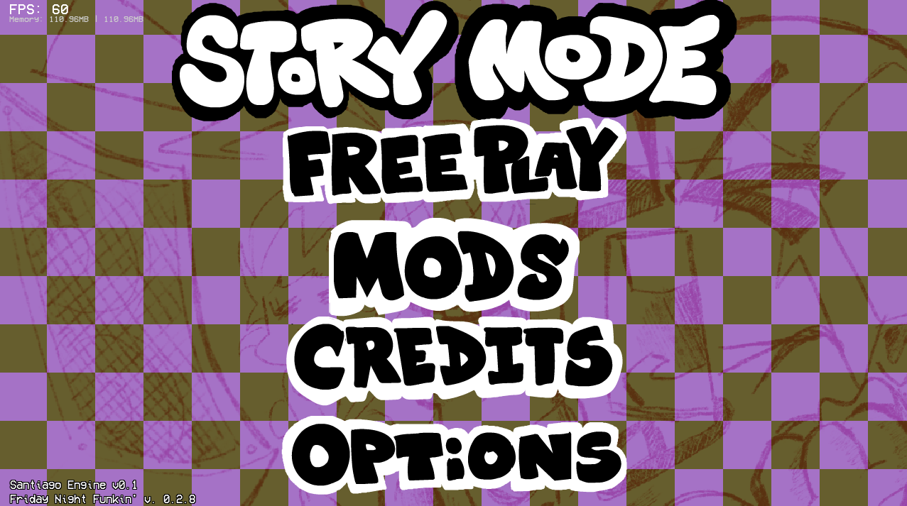

  
|  |  |
|:---:|:---:|
|  |  |
|  |  |

 
  
 
 

## A new FNF' Engine including:

- NEW MENUS.
- NEW EXPERIENCE
- RESULTS SCREEN (SOON)
- Fixes of the original engine.

________________________________________________________________________________________________________________

  
SantiagoEngine code and misc. are licensed under the [Apache 2.0 license](https://www.apache.org/licenses/LICENSE-2.0).

The original game assets, as music, images and etc. are licensed over [The Funkin' Crew Policy](funkin.me)
  

